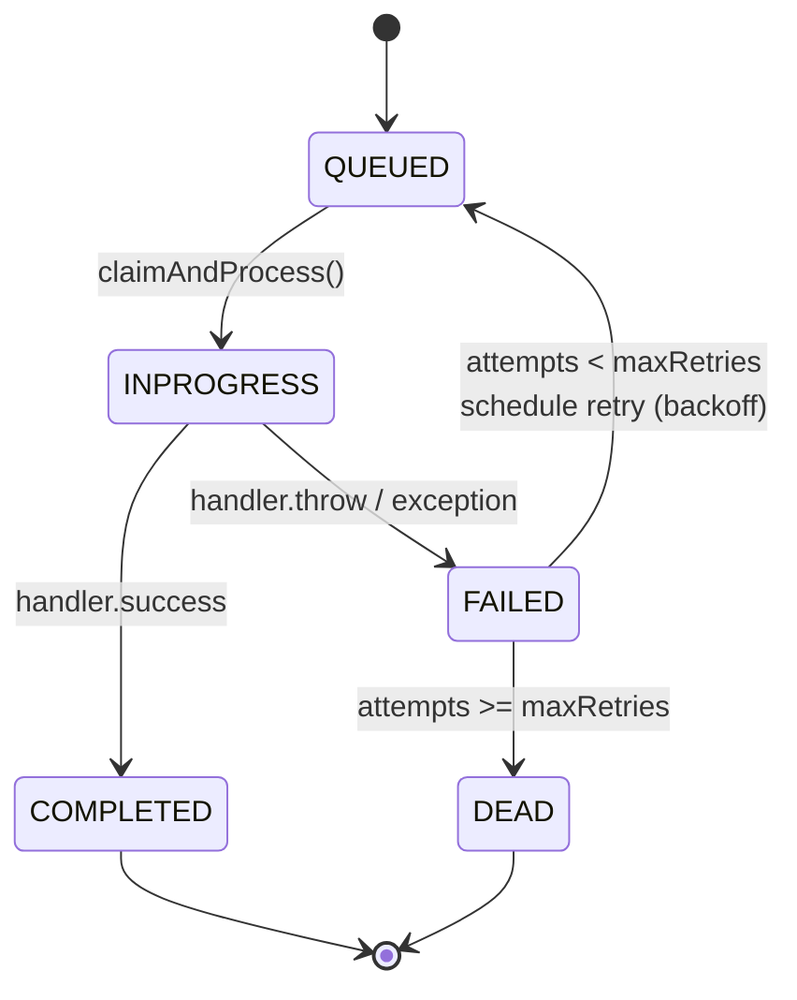
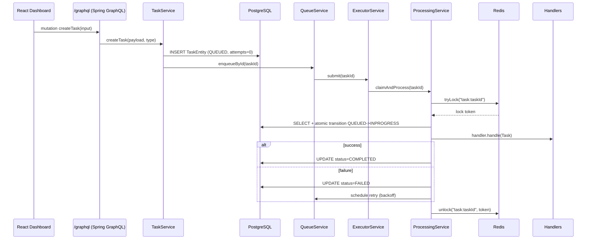
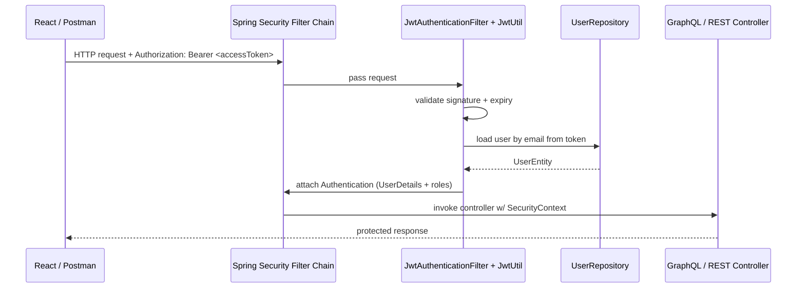
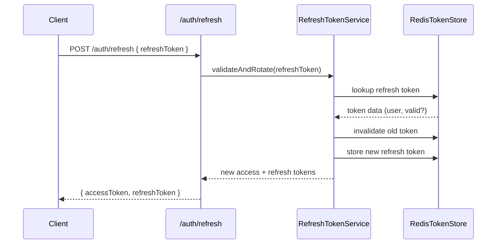

# SpringQueuePro
<u>Version</u>: <b>1.0</b> (*improvements expected to come*) <br>
<u>Author</u>: <b>Timan Zheng</b><br>
<u>Date</u>: <b>11/30/2025</b> (core backend system, *frontend dashboard finished by 12/8/2025*).<br>
<u>Description</u>: <b>This is a Production-Grade Distributed Task Queue System Built with Java, Spring Boot, Redis, PostgreSQL, GraphQL, REST APIs & React-TypeScript (among various other technologies).</b>

## Table of Contents
- [Overview](#overview)
- [Key Features](#key-features)

## Overview

**SpringQueuePro** is a distributed, fault-tolerant task processing platform that draws inspiration from real services like **Celery**, **BullMQ**, and **AWS SQS**. It was built and implemented from scratch in **Java** and **Spring Boot 3**. It features **persistent tasks**, **Redis-backed distributed locking**, **automatic retries with exponential backoff**, **JWT authentication**, **GraphQL & REST APIs**, and a **real-time React-TS dashboard**. Fully instrumented with **Micrometer + Prometheus** and integration-tested using **Testcontainers**. SpringQueuePro is designed as a backend-focused demonstration of how modern distributed task queues are architected in production environments, emphasizing correctness, observability, and fault tolerance over raw throughput. 

(As of 2025/12/09 its backend and related databases are hosted on **Railway**; its frontend dashboard on **Netlify**).

## Why the SpringQueue-"*Pro*"?
- **SpringQueuePro** is a professional, production-grade evolution of my aptly-titled **SpringQueue** project, an earlier primitive system that mimicked the same core functionality but tightly-coupled and limited in its extensibility, modularity, and production-like features. **SpringQueue** (***base***) was an intentionally skeletal job queue system and little more than an implementation of the Producer-Consumer model created to help learn the basics of Spring Boot. (*Additionally, it served to refresh my Java fundamentals after an absence from using the language. Not to mention an excuse to work with concurrency patterns in Java*).

- SpringQueue itself is a parallel implementation of **GoQueue**, an even earlier job queue project I built — also implementing the Producer-Consumer model, made to practice concurrency and thread-pool patterns in Go (Golang) using Go primitives like goroutines, channels, and mutexes. SpringQueue was a translation of GoQueue but refactored to make it more "idiomatically Java" (e.g., using an ExecutorService as the core thread manager).

## Key Features
- Distributed task processing with durable persistence (PostgreSQL)
- Redis-backed distributed locking to prevent double execution (race conditions).
- Atomic task state transitions (**QUEUED → IN_PROGRESS → COMPLETED / FAILED**)
- Automatic retries with exponential backoff
- Pluggable TaskHandler registry for extensible job logic
- JWT authentication with access + refresh tokens and rotation
- Role-based access control (RBAC) across GraphQL and REST APIs
- Fully instrumented with Micrometer + Prometheus
- Integration-tested using Testcontainers (Postgres + Redis)
- Dockerized for local development and cloud deployment

## System Architecture (Conceptual)

At a high level, the SpringQueuePro system is comprised of:

- **API Layer (GraphQL + REST)**  
  Exposes authenticated endpoints for task creation, inspection, and administration. All APIs are protected using a stateless JWT-based security model with role-based access control (RBAC).

- **Persistence Layer (PostgreSQL)**  
  Acts as the system of record for all tasks. Each task follows a strict lifecycle
  (**QUEUED → IN_PROGRESS → COMPLETED / FAILED**) enforced via atomic state transitions to prevent race conditions and duplicate execution.

- **Distributed Coordination Layer (Redis)**  
  Provides distributed locks and ephemeral coordination primitives. Redis-backed locks ensure that only one worker may claim and process a task at a time, even under concurrent execution. (*The traditiional caching "fast-lookup" utility of Redis is—of course—used too, but this is its most significant purpose*).

- **Execution Layer (ExecutorService Worker Pool)**  
  A configurable thread pool executes tasks asynchronously. Workers claim tasks transactionally, execute handler logic, and update task state deterministically.

- **Processing & Retry Orchestration**  
  Task execution is orchestrated via a dedicated `ProcessingService` that centralizes retry policies, exponential backoff, failure handling, and re-enqueue logic.

- **Security Layer (Spring Security + JWT)**  
  Authentication and authorization are enforced via a stateless filter chain with access/refresh token rotation, Redis-backed refresh token storage, and role-based access control across all APIs.

- **Observability Layer (Micrometer + Actuator + Prometheus)**  
  Provides first-class visibility into task throughput, processing latency, retries, failures, queue depth, JVM health, database connections, and Redis availability.

- **Presentation Layer (React + TypeScript Dashboard)**  
  A lightweight UI for interacting with the system, visualizing queue state, and monitoring backend health.

All components are containerized using Docker and designed to run identically in local, CI, and cloud environments.

# TO-DO: INSERT MERMAID DIAGRAM HERE!!!


```mermaid
flowchart LR
    Client[Client<br/>(React Dashboard / API Clients)]

    subgraph API[Spring Boot Application]
        Auth[Spring Security<br/>JWT + RBAC]
        GQL[GraphQL API]
        REST[REST API]

        Core[Queue & Processing Core]
    end

    subgraph Core
        TS[TaskService]
        QS[QueueService]
        PS[ProcessingService]
        H[TaskHandlers]
    end

    DB[(PostgreSQL)]
    Redis[(Redis)]
    Metrics[(Micrometer / Prometheus)]

    Client -->|HTTP + JWT| Auth
    Auth --> GQL
    Auth --> REST

    GQL --> TS
    REST --> TS

    TS --> DB
    TS --> QS

    QS --> PS
    PS --> DB
    PS --> Redis
    PS --> H

    API --> Metrics
```


---
## Key Features (old)

### 1. Persistent, Strongly-Typed Task Model

Tasks are first-class domain objects persisted in PostgreSQL via JPA:

```java
@Entity
@Table(name = "tasks")
public class TaskEntity {

    @Id
    private String id;

    @Column(columnDefinition = "text", nullable = false)
    private String payload;

    @Enumerated(EnumType.STRING)
    @Column(nullable = false)
    private TaskType type;

    @Enumerated(EnumType.STRING)
    @Column(nullable = false)
    private TaskStatus status;

    @Column(nullable = false)
    private int attempts;

    @Column(nullable = false)
    private int maxRetries;

    @Column(name = "created_at", columnDefinition = "TIMESTAMP WITH TIME ZONE")
    private Instant createdAt;

    @Version
    private Long version; // optimistic locking
    // getters/setters omitted
}
```
Key points:

* **PostgreSQL-backed**: every task is durable, queryable, and auditable.
* **Optimistic locking (@Version)**: protects against concurrent updates and stale writes.
* **Lifecycle fields**: `status`, `attempts`, `maxRetries`, `createdAt` make it easy to reason about retries and task age.

A `TaskMapper` translates between the persistence model (`TaskEntity`) and the in-memory processing model (`Task`), keeping the JPA layer cleanly separated from business logic.

---

### 2. QueueService + ProcessingService Worker Architecture

At runtime, SpringQueuePro behaves like a multi-threaded worker cluster inside a single JVM:

**QueueService** submits work to a thread pool by *task id*:

```java
@Service
public class QueueService {

    private final ExecutorService executor;
    private final ProcessingService processingService;

    public void enqueueById(String id) {
        executor.submit(() -> processingService.claimAndProcess(id));
    }
}
```

**ProcessingService** is the orchestrator that:

1. Atomically **claims** a task from the DB (`QUEUED → INPROGRESS`).
2. **Acquires a Redis lock** so only one worker can process a given task.
3. Maps `TaskEntity → Task` and routes it to the appropriate handler.
4. Persists the final result (`COMPLETED` or `FAILED`).
5. Schedules retries via a `ScheduledExecutorService` when needed.

Roughly:

```java
public void claimAndProcess(String taskId) {
    // 1. Acquire distributed lock
    String lockKey = "task:" + taskId;
    String token = lock.tryLock(lockKey, 2000);
    if (token == null) return; // another worker owns it

    try {
        // 2. Claim in DB (QUEUED → INPROGRESS, attempts++)
        TaskEntity claimed = taskRepository.claimForProcessing(taskId)
                .orElse(null);
        if (claimed == null) return;

        // 3. Map to domain model
        Task task = taskMapper.toDomain(claimed);

        // 4. Route to handler
        TaskHandler handler = handlerRegistry.getHandler(task.getType().name());
        if (handler == null) {
            handler = handlerRegistry.getHandler("DEFAULT");
        }

        handler.handle(task); // may throw for FAIL / FAILABS types

        // 5. Persist success
        claimed.setStatus(TaskStatus.COMPLETED);
        claimed.setAttempts(task.getAttempts());
        taskRepository.save(claimed);

    } catch (Exception ex) {
        // 6. Persist failure and schedule retry if allowed
        handleFailure(taskId, ex);
    } finally {
        lock.unlock(lockKey, token);
    }
}
```

This instills:

* **Thread-pool based concurrency** (`ExecutorService`).
* **DB-level atomic claims + optimistic locking** to prevent double-processing.
* **Redis-based distributed locks** to protect cross-node scenarios.
* A clean separation between *orchestration* (ProcessingService) and *execution* (TaskHandlers).

---

### 3. Redis-Backed Distributed Locking

Locking is implemented using simple, testable Redis primitives:

```java
@Component
public class RedisDistributedLock {

    private final StringRedisTemplate redis;

    public String tryLock(String key, long ttlMs) {
        String token = UUID.randomUUID().toString();
        Boolean ok = redis.opsForValue().setIfAbsent(
                key, token, Duration.ofMillis(ttlMs)
        );
        return Boolean.TRUE.equals(ok) ? token : null;
    }

    public boolean unlock(String key, String token) {
        return redis.execute((RedisCallback<Boolean>) conn -> {
            byte[] rawKey = redis.getStringSerializer().serialize(key);
            byte[] raw = conn.stringCommands().get(rawKey);
            if (raw == null) return false;
            String current = redis.getStringSerializer().deserialize(raw);
            if (!token.equals(current)) return false;
            conn.keyCommands().del(rawKey);
            return true;
        });
    }
}
```

Used by `ProcessingService` to guarantee:
* At most one worker (and one JVM) processes a given task at a time.
* Locks automatically expire via TTLs to avoid permanent deadlocks.
* Unlocks are **token-based**, preventing accidental unlocks by other workers.

---

### 4. Automatic Retries with Exponential Backoff

Retries are centralized in `ProcessingService`, not scattered across handlers (*which they were in earlier stages of the project e.g., the original SpringQueue*):

```java
private void handleFailure(String taskId, Exception ex) {
    TaskEntity failed = taskRepository.findById(taskId).orElse(null);
    if (failed == null) return;

    failed.setStatus(TaskStatus.FAILED);
    taskRepository.save(failed);

    if (failed.getAttempts() < failed.getMaxRetries()) {
        long delayMs = computeBackoffMs(failed.getAttempts());
        scheduler.schedule(
            () -> queueService.enqueueById(taskId),
            delayMs,
            TimeUnit.MILLISECONDS
        );
    }
}

private long computeBackoffMs(int attempts) {
    return (long) (1000 * Math.pow(2, Math.max(0, attempts - 1)));
}
```

Handlers like `FailHandler` and `FailAbsHandler` simply throw a custom `TaskProcessingException` when they want to fail — they don’t manually touch persistence or retries anymore. That makes business logic simple and keeps retry policy in one place.

---

### 5. GraphQL API for Task Management

Tasks are exposed via a type-safe GraphQL schema:

```graphql
type Task {
  id: ID!
  payload: String!
  type: TaskType!
  status: TaskStatus!
  attempts: Int!
  maxRetries: Int!
  createdAt: String!
}

enum TaskStatus { QUEUED INPROGRESS COMPLETED FAILED }
enum TaskType {
  EMAIL REPORT DATACLEANUP SMS NEWSLETTER TAKESLONG FAIL FAILABS TEST
}

input CreateTaskInput {
  payload: String!
  type: TaskType!
}

input StdUpdateTaskInput {
  id: ID!
  status: TaskStatus
  attempts: Int
}

type Query {
  tasks(status: TaskStatus): [Task!]!
  task(id: ID!): Task
}

type Mutation {
  createTask(input: CreateTaskInput!): Task!
  updateTask(input: StdUpdateTaskInput!): Task
  deleteTask(id: ID!): Boolean!
}
```

Resolved by a dedicated GraphQL controller:

```java
@Controller
public class TaskGraphQLController {

    private final TaskService taskService;

    @QueryMapping
    public List<TaskEntity> tasks(@Argument TaskStatus status) {
        return taskService.getAllTasks(status);
    }

    @QueryMapping
    public TaskEntity task(@Argument String id) {
        return taskService.getTask(id).orElse(null);
    }

    @MutationMapping
    public TaskEntity createTask(@Argument CreateTaskInput input) {
        return taskService.createTask(input.payload(), input.type());
    }

    @MutationMapping
    public TaskEntity updateTask(@Argument StdUpdateTaskInput input) {
        return taskService.updateTask(input);
    }

    @MutationMapping
    public boolean deleteTask(@Argument String id) {
        return taskService.deleteTask(id);
    }
}
```

Benefits:

* Strongly-typed schema, discoverable via GraphiQL.
* Flexible querying (filter by status, select specific fields).
* Easy integration with the React dashboard (`/graphql` endpoint).

There's also maintain a **mirror REST API** for learning and comparison (mostly my own learning), but GraphQL is the primary access layer for tasks.

---

### 6. JWT Authentication, Refresh Tokens & Role-Based Access Control

SpringQueuePro uses stateless JWT auth with access + refresh tokens and Redis-backed refresh storage:

* **Access tokens**: short-lived, used on every request (`Authorization: Bearer ...`).
* **Refresh tokens**: stored in Redis, rotated on each refresh, revocable via `/auth/logout`.
* **UserEntity**: persisted in PostgreSQL with password hashes (BCrypt).
* **Token validation** wired through a custom `JwtAuthenticationFilter` in the Spring Security filter chain.

A simplified `SecurityConfig`:

```java
@Configuration
@EnableMethodSecurity
public class SecurityConfig {

    @Bean
    public SecurityFilterChain filterChain(HttpSecurity http,
                                           JwtAuthenticationFilter jwtFilter) throws Exception {

        http
            .csrf(csrf -> csrf.disable())
            .sessionManagement(sm ->
                sm.sessionCreationPolicy(SessionCreationPolicy.STATELESS))
            .authorizeHttpRequests(auth -> auth
                .requestMatchers("/auth/**").permitAll()
                .requestMatchers("/actuator/health").permitAll()
                .requestMatchers("/graphql").authenticated()
                .requestMatchers("/api/**").authenticated()
                .anyRequest().permitAll()
            )
            .addFilterBefore(jwtFilter, UsernamePasswordAuthenticationFilter.class);

        return http.build();
    }
}
```

RBAC & security notes:

* Every incoming request passes through `JwtAuthenticationFilter`, which:

  * Extracts the JWT from the `Authorization` header.
  * Validates signature, expiry, and type (access vs refresh).
  * Loads the user from the DB and attaches a `UserDetails` principal.
* Authorization rules are enforced both:

  * At the **endpoint level** (`/auth/**` vs `/graphql`, `/api/**`).
  * And optionally via method-level annotations (e.g., `@PreAuthorize("hasRole('ADMIN')")`) if you want to differentiate roles later.

You also have:

* A `/auth/refresh` endpoint that issues new access tokens using a valid refresh token stored in Redis.
* A `/auth/logout` endpoint that invalidates refresh tokens and effectively logs the user out across the cluster.

---

### 7. Metrics, Actuator & Prometheus

SpringQueuePro is heavily instrumented with Micrometer:

* **Custom counters/timers** registered in a `ProcessingMetricsConfig`:

  * `springqpro_tasks_submitted_total`
  * `springqpro_tasks_claimed_total`
  * `springqpro_tasks_completed_total`
  * `springqpro_tasks_failed_total`
  * `springqpro_tasks_retried_total`
  * `springqpro_queue_enqueue_total`
  * `springqpro_queue_enqueue_by_id_total`
  * `springqpro_queue_memory_size`
  * `springqpro_task_processing_duration` (Timer/Histogram)
  * `springqpro_tasks_submitted_manually_total` (for user-initiated tasks via GraphQL/REST)

These are incremented in strategic points like:

* When a task is created (`TaskService.createTask`).
* When ProcessingService successfully claims a task.
* When a task completes, fails, or is scheduled for retry.
* When QueueService enqueues a task (by id or legacy in-memory).

Exposed through:

* `GET /actuator/metrics` – JSON endpoint for individual metrics.
* `GET /actuator/prometheus` – Prometheus scrape endpoint with all metrics.

This allows easy integration with Prometheus + soon-to-come Grafana dashboards.

---

### 8. Testability & CI

Testing approach:

* **Unit tests**:

  * `QueueServiceTests` – validating enqueue/clear/delete semantics and concurrency-safe access to the in-memory `jobs` map.
  * Handler tests (`EmailHandlerTests`, `FailHandlerTests`, etc.) – verifying behavior in isolation using injected `Sleeper` and `Random`.
  * Mapper tests (`TaskMapperTests`) – ensuring lossless mapping between `TaskEntity` and `Task`.

* **Integration tests (Testcontainers)**:

  * **Postgres-backed** tests for `TaskRepository` and `TaskService`.
  * **Redis-backed** tests for:

    * `RedisDistributedLockIntegrationTest`
    * `TaskCacheIntegrationTest`
    * `RedisPingIntegrationTest`
  * **JWT tests**: verifying `/auth/register`, `/auth/login`, `/auth/refresh`, `/auth/logout`, and protected endpoints behind the JWT filter chain.
  * **GraphQL controller tests**: ensuring `/graphql` can create tasks, query by status, and respect authentication.

* **CI (GitHub Actions)**:

  * Uses Maven build with tests.
  * Leverages Testcontainers to spin up real Postgres/Redis inside GitHub runners.
  * Ensures that every commit keeps your queue engine, persistence, Redis integration, and security workflow intact.

---
## Tech Stack

**Languages & Runtime**
* Java 21
* TypeScript (React frontend)
* SQL (PostgreSQL)

**Backend**
* Spring Boot 3 (Web, Data JPA, Security, GraphQL, Actuator)
* ExecutorService-based worker pool
* Custom `ProcessingService` orchestration layer
* Task handler registry (`TaskHandlerRegistry` + individual handlers)

**Persistence & Caching**

* PostgreSQL (via Spring Data JPA)
* Redis:

  * Distributed locks (`RedisDistributedLock`)
  * Refresh token store (`RedisTokenStore`)
  * Optional task cache (`TaskRedisRepository`)

**API & Protocols**

* GraphQL (schema-first, with Spring GraphQL)
* REST (Spring MVC controllers)
* JSON over HTTP (secured with JWT)

**Security**

* Spring Security (stateless, filter-chain based)
* JWT auth:

  * Access tokens
  * Refresh tokens with rotation
  * Redis-backed invalidation/blacklisting
* Role-based access control (RBAC-ready)

**Observability**
* Spring Boot Actuator
* Micrometer metrics
* Prometheus scrape endpoint (**TO-DO**: ready for Grafana dashboards)

**Testing**

* JUnit 5
* Spring Boot Test (`@SpringBootTest`, `@DataJpaTest`, `@DataRedisTest`)
* Testcontainers (Postgres, Redis)
* Mockito for unit-level mocking

**DevOps & Deployment**

* Maven for build & dependency management
* Docker & Docker Compose
* GitHub Actions CI
* Railway (backend, Postgres, Redis)
* Netlify (React dashboard)

---


## Architecture Design

### High-Level Component Diagram

```mermaid
flowchart LR
    subgraph ClientSide[Client Side]
        UI[React / Netlify Dashboard]
    end

    subgraph APILayer[Spring Boot API Layer]
        GQL[GraphQL Endpoint /graphql]
        REST[REST Controllers /api, /auth]
        Sec[Spring Security Filter Chain<br/>+ JwtAuthenticationFilter]
    end

    subgraph Core[Core Queue & Processing]
        TSvc[TaskService<br/>(create/query tasks)]
        QSvc[QueueService<br/>(enqueueById)]
        Proc[ProcessingService<br/>(claim + process + retry)]
        HReg[TaskHandlerRegistry]
        Handlers[Handlers<br/>(Email, Report, Fail, etc.)]
    end

    subgraph Infra[Infrastructure]
        DB[(PostgreSQL<br/>TaskRepository)]
        Redis[(Redis<br/>Locks + Tokens)]
        Metrics[Micrometer + Actuator<br/>/actuator/prometheus]
    end

    UI -->|HTTP + JWT| Sec
    Sec --> GQL
    Sec --> REST

    GQL --> TSvc
    REST --> TSvc

    TSvc --> DB
    TSvc --> QSvc

    QSvc --> Proc
    Proc --> DB
    Proc --> Redis
    Proc --> HReg
    HReg --> Handlers

    Core --> Metrics
    APILayer --> Metrics
```

---

### Task Lifecycle Diagram



---

## Flow: From GraphQL Mutation to Worker Execution

### Sequence: Create & Process Task



---

## Security & JWT / RBAC Flow

### Sequence: Protected Request



### Sequence: Refresh Token Rotation



---

## GraphQL Usage Examples

**Create a task:**

```graphql
mutation CreateEmailTask {
  createTask(input: { payload: "Send welcome email", type: EMAIL }) {
    id
    status
    attempts
    createdAt
  }
}
```

**Query tasks by status:**

```graphql
query QueuedTasks {
  tasks(status: QUEUED) {
    id
    type
    status
    attempts
  }
}
```

**Update task status (if needed from API side):**

```graphql
mutation UpdateTaskStatus {
  updateTask(input: { id: "Task-123", status: FAILED }) {
    id
    status
    attempts
  }
}
```

The React dashboard uses these operations behind the scenes to:

* Authenticate the user and attach tokens.
* Create tasks of different types.
* Poll or query for recent tasks and their statuses.
* Display queue health and summary metrics.

---

## Testing Strategy (Recommended)

1. **Unit Tests**

   * `QueueServiceTests`

     * Enqueueing tasks.
     * Clearing the queue.
     * Deleting tasks.
   * `ProcessingServiceTests` (with mocks for TaskRepository, RedisDistributedLock, TaskHandlerRegistry)

     * Successful claim and process flow.
     * Failure flow + retry scheduling.
     * Lock acquisition failure.
   * Handler tests (`EmailHandlerTests`, `FailHandlerTests`, etc.)

     * Correct behavior per handler type.
   * Security helpers (`JwtUtilTests`)

     * Token generation, parsing, expiry behavior.
   * Mapper tests (`TaskMapperTests`).

2. **Integration Tests (Testcontainers)**

   * **Postgres integration**

     * `TaskRepositoryIntegrationTest`
     * `TaskServiceIntegrationTest` for CRUD + persistence flows.
   * **Redis integration**

     * `RedisDistributedLockIntegrationTest`
     * `TaskCacheIntegrationTest`
     * `RedisPingIntegrationTest`
   * **JWT + Security**

     * `AuthenticationFlowIntegrationTest`:

       * `/auth/register`, `/auth/login`, `/auth/refresh`, `/auth/logout`.
       * Accessing `/graphql` and `/api/**` with/without tokens.
   * **GraphQL Controller**

     * `TaskGraphQLIntegrationTest`:

       * Create task → verify persisted in DB.
       * Query tasks by status.
       * Delete task and verify.

3. **Smoke / E2E Tests (Future)**

   * Use Postman collections, k6, or JMeter to:

     * Fire bursts of task create requests.
     * Observe processing latency and retry behavior.
     * Validate system under quasi-real load.


### Project Structure
```
src
├── main
│  ├── java
│  │  └── com
│  │     └── springqprobackend
│  │        └── springqpro
│  │           ├── config
│  │           │  ├── ExecutorConfig.java
│  │           │  ├── GlobalExceptionHandler.java
│  │           │  ├── ProcessingMetricsConfig.java
│  │           │  ├── QueueProperties.java
│  │           │  ├── RedisConfig.java
│  │           │  ├── SecurityConfig.java
│  │           │  └── TaskHandlerProperties.java
│  │           ├── controller
│  │           │  ├── auth
│  │           │  │  └── AuthenticationController.java
│  │           │  ├── graphql
│  │           │  │  ├── GraphiQLRedirectController.java
│  │           │  │  └── TaskGraphQLController.java
│  │           │  ├── rest
│  │           │  │  ├── ProcessingEventsController.java
│  │           │  │  ├── ProducerController.java
│  │           │  │  ├── SystemHealthController.java
│  │           │  │  └── TaskRestController.java
│  │           │  └── controllerRecords.java
│  │           ├── domain
│  │           │  ├── entity
│  │           │  │  ├── TaskEntity.java
│  │           │  │  └── UserEntity.java
│  │           │  ├── event
│  │           │  │  └── TaskCreatedEvent.java
│  │           │  └── exception
│  │           │     └── TaskProcessingException.java
│  │           ├── enums
│  │           │  ├── TaskStatus.java
│  │           │  └── TaskType.java
│  │           ├── handlers
│  │           │  ├── DataCleanUpHandler.java
│  │           │  ├── DefaultHandler.java
│  │           │  ├── EmailHandler.java
│  │           │  ├── FailAbsHandler.java
│  │           │  ├── FailHandler.java
│  │           │  ├── NewsLetterHandler.java
│  │           │  ├── ReportHandler.java
│  │           │  ├── SmsHandler.java
│  │           │  ├── TakesLongHandler.java
│  │           │  └── TaskHandler.java
│  │           ├── listeners
│  │           │  └── TaskCreatedListener.java
│  │           ├── mapper
│  │           │  └── TaskMapper.java
│  │           ├── models
│  │           │  ├── Task.java
│  │           │  └── TaskHandlerRegistry.java
│  │           ├── redis
│  │           │  ├── RedisDistributedLock.java
│  │           │  ├── RedisTokenStore.java
│  │           │  ├── Redis_Lua_Note.md
│  │           │  └── TaskRedisRepository.java
│  │           ├── repository
│  │           │  ├── TaskRepository.java
│  │           │  └── UserRepository.java
│  │           ├── runtime
│  │           │  └── Worker.java
│  │           ├── security
│  │           │  ├── dto
│  │           │  │  ├── AuthRequest.java
│  │           │  │  ├── AuthResponse.java
│  │           │  │  ├── LoginRequest.java
│  │           │  │  ├── RefreshRequest.java
│  │           │  │  └── RegisterRequest.java
│  │           │  ├── CustomUserDetailsService.java
│  │           │  ├── JwtAuthenticationFilter.java
│  │           │  ├── JwtUtil.java
│  │           │  └── RefreshTokenService.java
│  │           ├── service
│  │           │  ├── ProcessingService.java
│  │           │  ├── QueueService.java
│  │           │  └── TaskService.java
│  │           ├── util
│  │           │  ├── RealSleeper.java
│  │           │  └── Sleeper.java
│  │           └── SpringQueueProApplication.java
│  └── resources
│     ├── graphql
│     │  └── schema.graphqls
│     ├── static
│     │  └── graphiql
│     │     └── index.html
│     ├── templates
│     ├── application-prod.yml
│     ├── application.properties
│     └── application.yml
└── test
   ├── java
   │  └── com
   │     └── springqprobackend
   │        └── springqpro
   │           ├── config
   │           │  └── RedisTestConfig.java
   │           ├── handlers
   │           │  ├── DefaultHandlerTests.java
   │           │  └── FailHandlerTests.java
   │           ├── integration
   │           │  ├── AuthJwtIntegrationTest.java
   │           │  ├── CreateAndProcessTaskIntegrationTest.java
   │           │  ├── OwnershipGraphQLIntegrationTest.java
   │           │  ├── ProcessingConcurrencyIntegrationTest.java
   │           │  ├── RedisDistributedLockIntegrationTest.java
   │           │  ├── RedisPingIntegrationTest.java
   │           │  ├── RetryBehaviorIntegrationTest.java
   │           │  ├── TaskCacheIntegrationTest.java
   │           │  └── TaskGraphQLIntegrationTest.java
   │           ├── models
   │           │  └── TaskHandlerRegistryTests.java
   │           ├── runtime
   │           │  └── WorkerTests.java
   │           ├── service
   │           │  └── QueueServiceTests.java
   │           ├── testcontainers
   │           │  ├── BasePostgresContainer.java
   │           │  ├── BaseRedisContainer.java
   │           │  ├── IntegrationTestBase.java
   │           │  └── RedisIntegrationTestBase.java
   │           └── SpringQueueProApplicationTests.java
   └── resources
      ├── application-test.properties
      └── application-test.yml
```
