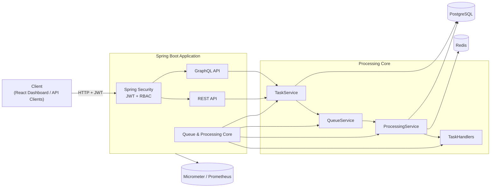
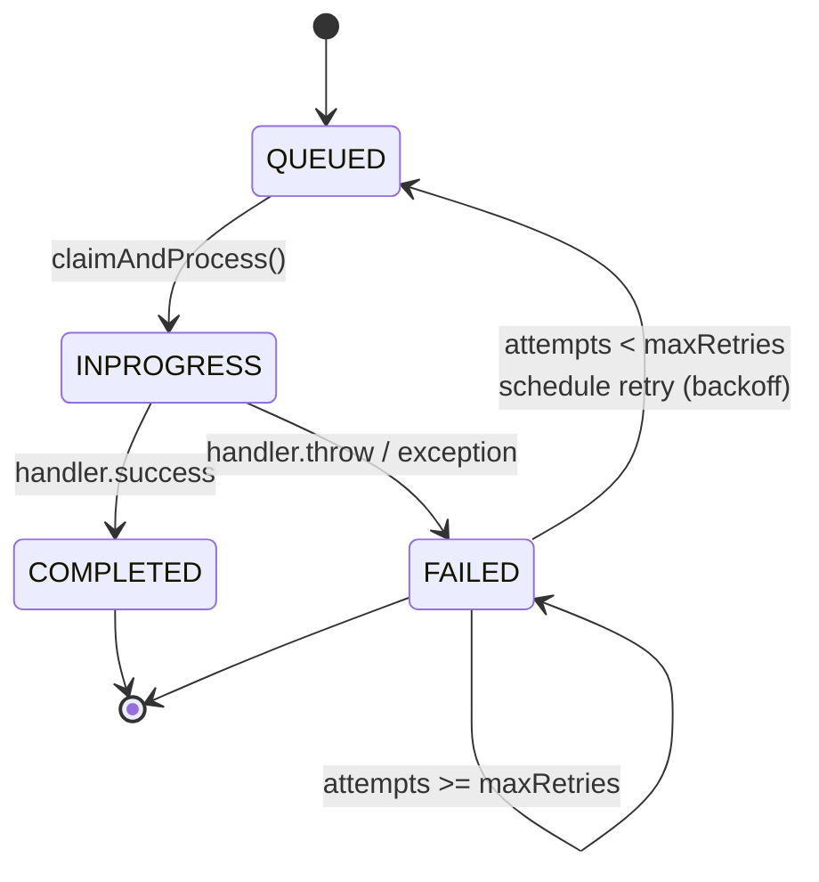
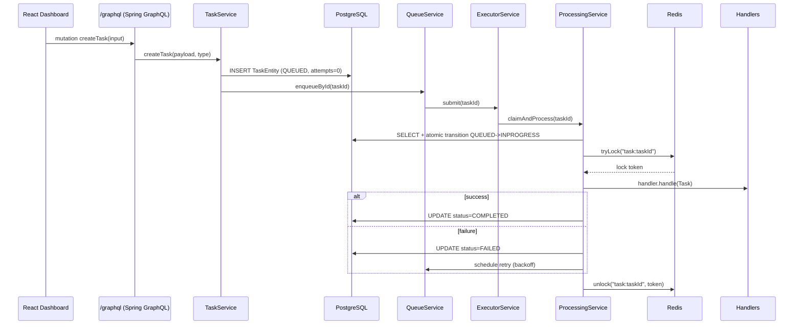
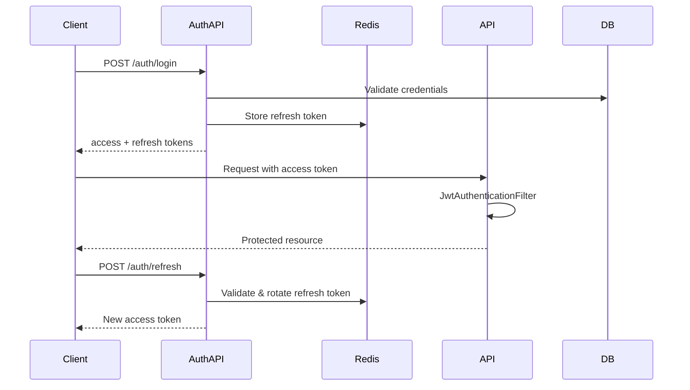
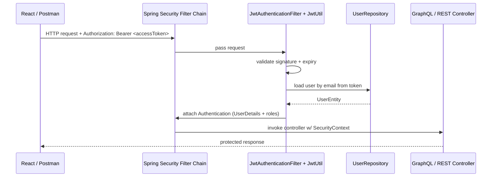
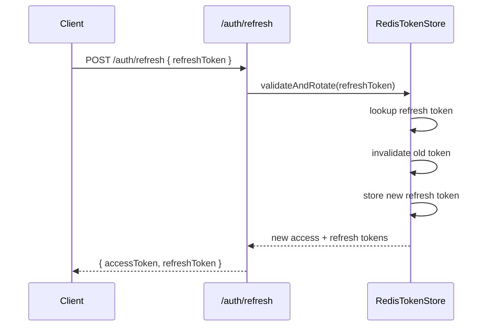

# SpringQueuePro
<u>Version</u>: <b>1.0</b> (*improvements expected to come*) <br>
<u>Author</u>: <b>Timan Zheng</b><br>
<u>Date</u>: <b>11/30/2025</b> (core backend system, *frontend dashboard finished by 12/8/2025*).<br>
<u>Description</u>: <b>This is a Production-Grade Distributed Task Queue System Built with Java, Spring Boot, Redis, PostgreSQL, GraphQL, REST APIs & React-TypeScript (among various other technologies).</b>

## Table of Contents
- [Overview](#overview)
- [Key Features](#key-features)
- [System Architecture (Conceptual)](#system-architecture-conceptual)
- [System Architecture (Mermaid Diagram)](#high-level-system-architecture-diagram-mermaid)
- [Core Execution Flow (Task Lifecycle)](#core-execution-flow)
- [Internal Design and Implementation Details](#internal-design--implementation-details)
- [Internal Design, etc - 1. The Task Model](#1-persistent-strongly-typed-task-model) 
- [Internal Design, etc - 2. QueueService and ProcessingService](#2-queueservice--processingservice-worker-architecture)
- [Internal Design, etc - 3. Redis Coordination and Locking](#3-redis-backed-distributed-coordination--locking)
- [Internal Design, etc - 4. Automatic Retries w/ Exponential Backoff](#4-automatic-retries-with-exponential-backoff)
- [Internal Design, etc - 5. Task Management GraphQL API](#5-graphql-api-for-task-management)
- [Internal Design, etc - 6. JWT Authentication, Refresh Tokens, RBAC](#6-jwt-authentication-refresh-tokens--role-based-access-control)
- [Internal Design, etc - 7. Metrics, Actuator & Prometheus](#7-metrics-actuator--prometheus)
- [Internal Design, etc - 8. Testability & CI](#8-testability--ci)
- [Internal Design, etc - 9. Testing Strategies](#testing-strategy-recommended)
- [Docker & Containerization](#docker--containerization)
- [Tech Stack](#tech-stack)
- [Project Structure](#project-structure)
- [Limitations & Deferred Work](#limitations--deferred-work)
- [Future Steps & CloudQueue](#future-steps--cloudqueue)

## Overview

**SpringQueuePro** is a distributed, fault-tolerant task processing platform that draws inspiration from real services like **Celery**, **BullMQ**, and **AWS SQS**. It was built and implemented from scratch in **Java** and **Spring Boot 3**. It features **persistent tasks**, **Redis-backed distributed locking**, **automatic retries with exponential backoff**, **JWT authentication**, **GraphQL & REST APIs**, and a **real-time React-TS dashboard**. Fully instrumented with **Micrometer + Prometheus** and integration-tested using **Testcontainers**. SpringQueuePro is designed as a backend-focused demonstration of how modern distributed task queues are architected in production environments, emphasizing correctness, observability, and fault tolerance over raw throughput. 

(As of 2025/12/09 its backend and related databases are hosted on **Railway**; its frontend dashboard on **Netlify**).

## Why the SpringQueue-"*Pro*"?
- **SpringQueuePro** is a professional, production-grade evolution of my aptly-titled **SpringQueue** project, an earlier primitive system that mimicked the same core functionality but tightly-coupled and limited in its extensibility, modularity, and production-like features. **SpringQueue** (***base***) was an intentionally skeletal job queue system and little more than an implementation of the Producer-Consumer model created to help learn the basics of Spring Boot. (*Additionally, it served to refresh my Java fundamentals after an absence from using the language. Not to mention an excuse to work with concurrency patterns in Java*).

- SpringQueue itself is a parallel implementation of **GoQueue**, an even earlier job queue project I built — also implementing the Producer-Consumer model, made to practice concurrency and thread-pool patterns in Go (Golang) using Go primitives like goroutines, channels, and mutexes. SpringQueue was a translation of GoQueue but refactored to make it more "idiomatically Java" (e.g., using an ExecutorService as the core thread manager).

## Key Features
- Distributed task processing with durable persistence (PostgreSQL)
- Redis-backed distributed locking to prevent double execution (race conditions).
- Atomic task state transitions (**QUEUED → INPROGRESS → COMPLETED / FAILED**)
- Automatic retries with exponential backoff
- Pluggable TaskHandler registry for extensible job logic
- JWT authentication with access + refresh tokens and rotation
- Role-based access control (RBAC) across GraphQL and REST APIs
- Fully instrumented with Micrometer + Prometheus
- Integration-tested using Testcontainers (Postgres + Redis)
- Dockerized for local development and cloud deployment

## System Architecture (Conceptual)

At a high level, the SpringQueuePro system is comprised of:

- **API Layer (GraphQL + REST)**  
  Exposes authenticated endpoints for task creation, inspection, and administration. All APIs are protected using a stateless JWT-based security model with role-based access control (RBAC).

- **Persistence Layer (PostgreSQL)**  
  Acts as the system of record for all tasks. Each task follows a strict lifecycle
  (**QUEUED → INPROGRESS → COMPLETED / FAILED**) enforced via atomic state transitions to prevent race conditions and duplicate execution.

- **Distributed Coordination Layer (Redis)**  
  Provides distributed locks and ephemeral coordination primitives. Redis-backed locks ensure that only one worker may claim and process a task at a time, even under concurrent execution. (*The traditiional caching "fast-lookup" utility of Redis is—of course—used too, but this is its most significant purpose*).

- **Execution Layer (ExecutorService Worker Pool)**  
  A configurable thread pool executes tasks asynchronously. Workers claim tasks transactionally, execute handler logic, and update task state deterministically.

- **Processing & Retry Orchestration**  
  Task execution is orchestrated via a dedicated `ProcessingService` that centralizes retry policies, exponential backoff, failure handling, and re-enqueue logic.

- **Security Layer (Spring Security + JWT)**  
  Authentication and authorization are enforced via a stateless filter chain with access/refresh token rotation, Redis-backed refresh token storage, and role-based access control across all APIs.

- **Observability Layer (Micrometer + Actuator + Prometheus)**  
  Provides first-class visibility into task throughput, processing latency, retries, failures, queue depth, JVM health, database connections, and Redis availability.

- **Presentation Layer (React + TypeScript Dashboard)**  
  A lightweight UI for interacting with the system, visualizing queue state, and monitoring backend health.

All components are containerized using Docker and designed to run identically in local, CI, and cloud environments.

## High-Level System Architecture Diagram (Mermaid):


## Core Execution Flow

This section describes the end-to-end lifecycle of a Task in SpringQueuePro. First, a mermaid diagram to visualize the lifecycle before a procedural analysis.

### Task Lifecycle Diagram



### Task Lifecycle Step-by-Step

### 1. Task Submission
A task is submitted via an authenticated GraphQL or REST API call (*presumably initiated from the React frontend or a Postman call*). The request is validated, authorized, and persisted to PostgreSQL with an initial state of `QUEUED`.

Metrics emitted:
- `springqpro_tasks_submitted_total`
- `springqpro_tasks_submitted_manually_total`

### 2. Task Claiming
Workers asynchronously attempt to claim queued tasks.

A worker first performs an **atomic database transition**:

`QUEUED → INPROGRESS`

This transition is the **authoritative claim** and succeeds only if the task is still in the expected state. If the update affects zero rows, another worker has already claimed the task.

After a successful database claim, the worker attempts to acquire a **Redis-backed distributed lock** to coordinate execution across threads or nodes.

If the Redis lock cannot be acquired, the task is safely returned to `QUEUED` so that another worker may process it later.

Metrics emitted:
- `springqpro_tasks_claimed_total`

### 3. Task Execution
The claimed task is converted into a domain model and dispatched to a registered `TaskHandler`. Handler logic executes inside a controlled worker thread.

Processing time is recorded using a Micrometer `Timer`.

Metrics emitted:
- `springqpro_task_processing_duration`

### 4. Completion or Failure
- On success, the task transitions to `COMPLETED`
- On failure, it transitions to `FAILED`

Metrics emitted:
- `springqpro_tasks_completed_total`
- `springqpro_tasks_failed_total`

### 5. Retry & Backoff
If the task has remaining retry attempts, it is re-enqueued using exponential backoff. Retry scheduling is centralized in the ProcessingService to ensure consistent behavior.

Metrics emitted:
- `springqpro_tasks_retried_total`

Tasks exceeding retry limits are safely and cleanly retired.

---

## Internal Design & Implementation Details

This section provides a deeper look into the internal engineering decisions behind SpringQueuePro. While the previous sections describe what the system does and how tasks flow through it, the following sections explain how each core subsystem is implemented.

### 1. Persistent, Strongly-Typed Task Model

SpringQueuePro models tasks as **first-class domain objects** with a clear separation between:
- **Persistence Representation** (Database State)
- **In-Memory Domain Representation** (Business Logic Execution)

This separation is intentional and foundational to the system's reliability, concurrency guarantees, and extensibility. (The persisted database representation of the task, `TaskEntity` is never passed into business logic; it stands as the "source of truth". Instead, a `Task` representation is created and processed, changes relayed to `TaskEntity` afterwards. This is all to enforce **Domain-Driven Design (DDD)**).
- A `TaskMapper` translates between the persistence model (`TaskEntity`) and the in-memory processing model (`Task`), keeping the JPA layer cleanly separated from business logic. (*More on this shortly*).

### 1.1 — TaskEntity — The Persistent Source of Truth

All tasks are durably stored in PostgreSQL via JPA using `TaskEntity`:

```java
@Entity
@Table(name = "tasks")
public class TaskEntity {

    @Id
    private String id;

    @Column(columnDefinition = "text", nullable = false)
    private String payload;

    @Enumerated(EnumType.STRING)
    @Column(nullable = false)
    private TaskType type;

    @Enumerated(EnumType.STRING)
    @Column(nullable = false)
    private TaskStatus status;

    @Column(nullable = false)
    private int attempts;

    @Column(nullable = false)
    private int maxRetries;

    @Column(name = "created_at", columnDefinition = "TIMESTAMP WITH TIME ZONE")
    private Instant createdAt;

    @Version
    private Long version; // optimistic locking
    // getters/setters omitted
}
```
**Key Design Characteristics**:
- **PostgreSQL-backed Durability**:   
  Every task is persisted, queryable, auditable, and survives process restarts or crashes.
- **Optimistic Locking** (`@Version`):   
  Protects against stale writes and concurrent updates where multiple workers compete to update the same task row.
- **Explicit Lifecycle Fields**:   
  `status`, `attempts`, `maxRetries`, and `createdAt` allow the system to reason deterministically about retries, backoff, and task aging (*more for frontend dashboard "quality of life" features where you can sort the tasks in whatever way*).
- **Strict Lifecycle Enforcement**:   
  Tasks transition only through controlled state changes:
  ```
  QUEUED → INPROGRESS → COMPLETED / FAILED → (RETRY or FAILED)
  ``` 
`TaskEntity` is treated as the **authoritative system-of-record**, and all concurrency control (claims, retries, requeueing) ultimately resolves to safe database state transitions.

### 1.2 Task — The In-Memory Domain Model

While `TaskEntity` represents persisted state, **task execution logic never operates directly on JPA entities** (*again, this is adhering to DDD principles*).

Instead, SpringQueuePro uses a separate in-memory **domain model**, `Task`:
```java
/* The gist of the class (there's more clutter in the actual
class definition that I'm going to omit, still present from previous stages of this project evolution — but that's a story for another day / another document I'm yet to write):
*/
public class Task {
    private String id;
    private String payload;
    private TaskType type;
    private TaskStatus status;
    private int attempts;
    private int maxRetries;
    private Instant createdAt;
    private String createdBy;
    // Ignore all clutter from past evolution stages of the project...
}
```
**Why the Separation Matters**:
- **Clear Domain Boundaries**:   
  Business logic (handlers) should not depend on persistence concerns like lazy-loading, entity managers, or transaction scopes.
- **Safer Concurrency Semantics**:  
  JPA entities are mutable and tied to persistence context; passing them to worker threads is error-prone (*and again, against DDD*).
- **Cleaner Handler Contracts**:  
  `TaskHandler`s operate on simple, validated domain objects with no persistence side effects.
- **Future Extensibility**:  
  This design allows for:
  - Multiple Persistence Backends
  - Message-based Execution
  - Remote Workers
  - Event Sourcing w/o rewriting `TaskHandler` logic.

### 1.3 TaskMapper — Bridging Persistence and Execution

A dedicated `TaskMapper` class translates between the two representations:
- `TaskEntity -> Task` when a task is claimed for processing.
- `Task -> TaskEntity` when processing completes or fails.

This keeps responsibilities cleanly separated:
```
Database State <--> TaskEntity <--TaskMapper--> Task <--> TaskHandler
```
The mapper ensures that only relevant fields flow into business logic, execution results are explicitly persisted into the database, and no accidental persistence side effects occur during processing.

### 1.4 How This Integrates with `ProcessingService`

`ProcessingService` will be expanded on in more detail shortly, but recall and understand that this is the Service that orchestrates and coordinates the processing of tasks via worker threads. Here is how the `TaskEntity` and `Task` design comes together inside `ProcessingService.claimAndProcess(String taskId)`:

1. **Load Snapshot**:  
  Fetch the current `TaskEntity` from PostgreSQL (where it is first persisted):
  ```java
  Optional<TaskEntity> snapshot = taskRepository.findById(taskId);    // NOTE: Remember this is a built-in function when you extend JPA.
  if(snapshot.isEmpty()) return;
  TaskEntity current = snapshot.get();
  ```
2. **Atomic Claim**:  
  Perform a guarded state transition:
  ```java
  int updated = taskRepository.transitionStatus(taskId, TaskStatus.QUEUED, TaskStatus.INPROGRESS, current.getAttempts() + 1);
  ```
  > The database transition is the *true ownership boundary*.
  > Redis locking is applied **after claiming** to coordinate safe execution, not to decide task ownership.

3. **Distributed Lock Acquisition**:  
  Use Redis to ensure that only one worker processes the task across threads or nodes.
  ```java
  String lockKey = "task:lock:" + taskId;
  String token = redisLock.tryLock(lockKey, 2000);
  logEvent("LOCK_ACQUIRED " + taskId);
  if(token == null) {
      logEvent("LOCK_FAILED " + taskId + " returning task to QUEUED");
      taskRepository.transitionStatus(taskId, TaskStatus.INPROGRESS, TaskStatus.QUEUED, claimed.getAttempts());
      return;
  }
  ```
  It's glossed over in this display but, of course, the Redis lock is lifted after the processing completes (successfully or not).

4. **Domain Mapping**:  
  Convert `TaskEntity -> Task` before invoking handlers:
  ```java
  Task model = taskMapper.toDomain(claimed);
  ```
5. **Task Execution**:  
  Dispatch the domain `Task` to a registered `TaskHandler`:
  ```java
  TaskHandler handler = handlerRegistry.getHandler(model.getType().name());
  if (handler == null) handler = handlerRegistry.getHandler("DEFAULT");
  handler.handle(model);
  ```
6. **Persistence Update**:
  Map execution results back into the `TaskEntity` and persist them.
  ```java
  model.setStatus(TaskStatus.COMPLETED);
  taskMapper.updateEntity(model, claimed);
  TaskEntity persisted = taskRepository.save(claimed);
  cache.put(claimed);
  ```
It's this design choice to keep **state transactions transactional** and **execution isolated** that SpringQueuePro achieves idempotent task processing, strong concurrency safety, deterministic retry behavior, and clean separation of concerns.

**IN SUMMARY**, this dual-model approach is integral to how SpringQueuePro behaves like a real production-grade distributed queue system (rather than a simple in-memory job runner, which is what the base levels of SpringQueue and GoQueue are). This mirrors patterns used in:
- Production Job Queues
- Workflow Engines
- Event-Driven Microservices
- Distributed Schedulers

It also forms the foundation for my project's impressive:
- Redis-based Locking
- Retry Orchestration
- Observability Instrumentation
- Secure Multi-User Access
- Future Horizontal Scaling

---

### 2. QueueService + ProcessingService Worker Architecture

### 2.1 QueueService Architecture:

At runtime, SpringQueuePro behaves like a **multi-threaded worker cluster operating inside a single JVM**, designed with distributed execution semantics in mind.
- `QueueService` is intentionally minimal and acts purely as a dispatch layer. Rather than handling business logic, locking, or retries, it submits work to a worker pool by task ID only.

- **NOTE**: In early stages of SpringQueuePro, basically all of the system functionality was tightly-coupled into `QueueService`. You can see this in SpringQueue (base) version, *but that's a story for another time*.

**QueueService** submits work to a thread pool by *task id*:
```java
@Service
public class QueueService {
    private final ExecutorService executor;
    private final ProcessingService processingService;

    public void enqueueById(String id) {
        executor.submit(() -> processingService.claimAndProcess(id));
    }

    /* NOTE: If you inspect the QueueService.java class file, you will notice that there's A LOT inside of it. Many more methods, constructors, and fields all marked with @Deprecated. That's because this project has undergone many changes to evolve it into its current stage! At some point I will document the growth of this project and the evolution of its heavily decoupled architecture! */
}
```
You might wonder why tasks are enqueued by their **Task ID** instead of passing in, say, a domain Task model. There are several reasons for this, and it's because this design choice ensures:
- Tasks are always **reloaded from the database**, avoiding stale in-memory state (fresh DB reads are forced).
- Execution remains **idempotent** and retry-safe.
- The system can later scale to multiple JVMs w/o changing execution semantics.

---

### 2.2 ProcessingService Architecture

**ProcessingService** is the *central orchestrator* responsible for enforcing correctness and reliability guarantees. It owns the entire execution lifecycle of a task:

1. **Atomically claims** a task in PostgreSQL
   (authoritative ownership, `QUEUED → INPROGRESS`, attempts incremented in a single transaction)
2. **Attempts Redis lock acquisition** for execution coordination
3. **Maps persistence → domain models** (`TaskEntity → Task`)
4. **Routes execution** to a pluggable `TaskHandler`
5. **Persists final state** (`COMPLETED` or `FAILED`)
6. **Schedules retries with exponential backoff** when allowed

```java
public void claimAndProcess(String taskId) {
    /* NOTE: Not actually representative of ProcessingService's claimAndProcess(...) method, more an extremely simplified outline of its core operations (it would be too much code bloat to add here). */
    TaskEntity claimed = taskRepository.claimForProcessing(taskId).orElse(null);
    if (claimed == null) return;
    String lockKey = "task:" + taskId;
    String token = lock.tryLock(lockKey, 2000);
    if (token == null) {
        taskRepository.transitionStatus(taskId, INPROGRESS, QUEUED);
        return;
    }

    try {
        Task task = taskMapper.toDomain(claimed);

        TaskHandler handler = handlerRegistry.getHandler(task.getType().name());
        if (handler == null) handler = handlerRegistry.getHandler("DEFAULT");

        handler.handle(task);

        claimed.setStatus(TaskStatus.COMPLETED);
        claimed.setAttempts(task.getAttempts());
        taskRepository.save(claimed);

    } catch (Exception ex) {
        handleFailure(taskId, ex);  // I don't actually have a method for this, it just happens in-method in the actual claimAndProcess(...)
    } finally {
        lock.unlock(lockKey, token);
    }
}
```
This architecture — which centralizes concurrency control, retries, and state transitions within a single service — provides several strong guarantees:
- **At-most-once execution** per task attempt
  (DB atomic claims + Redis locks)
- **Crash safety** — worker crashes do not lose tasks
- **Deadlock prevention** via Redis TTL-based locks
- **Retry isolation** — business logic never schedules retries directly
- **Observability by design** — all execution passes through a single orchestration point

---

## 3. Redis-Backed Distributed Coordination & Locking

SpringQueuePro uses Redis as a **distributed coordination layer**, not merely as a cache. Its primary responsibility is to enforce **mutual exclusion and safety guarantees** during task execution, especially under concurrent worker scenarios.

### Distributed Lock Implementation

Locking is implemented using minimal, testable Redis primitives (`SETNX + TTL`) combined with a **Lua-based atomic unlock**:

```java
@Component
public class RedisDistributedLock {

    private final StringRedisTemplate redis;
    private final DefaultRedisScript<Long> releaseScript;

    public RedisDistributedLock(StringRedisTemplate redis) {
        this.redis = redis;

        // Atomic unlock: delete only if token matches
        String lua =
            "if redis.call('get', KEYS[1]) == ARGV[1] " +
            "then return redis.call('del', KEYS[1]) " +
            "else return 0 end";

        releaseScript = new DefaultRedisScript<>();
        releaseScript.setScriptText(lua);
        releaseScript.setResultType(Long.class);
    }

    public String tryLock(String key, long ttlMs) {
        String token = UUID.randomUUID().toString();
        Boolean ok = redis.opsForValue()
                .setIfAbsent(key, token, Duration.ofMillis(ttlMs));
        return Boolean.TRUE.equals(ok) ? token : null;
    }

    public boolean unlock(String key, String token) {
        Long res = redis.execute(
            releaseScript,
            Collections.singletonList(key),
            token
        );
        return res != null && res > 0;
    }
}
```
This locking strategy guarantees:

- **Single-worker execution**
  At most one worker (and one JVM) can process a given task at any time—even under concurrent thread execution.

- **Crash safety via TTLs**
  Locks automatically expire, preventing permanent deadlocks if a worker crashes mid-task.

- **Correct ownership enforcement**
  Unlocking is **token-validated and atomic**, ensuring that only the worker that acquired a lock can release it (a common pitfall in naive Redis locking).

- **Minimal operational complexity**
  The implementation avoids heavy frameworks (e.g., Redisson) in favor of transparent primitives, making behavior easy to reason about and test.

### How Redis Fits Into the Larger System

Redis is intentionally scoped to **ephemeral coordination concerns**, not durable state:

- **Distributed task locks** (this section)
- **Refresh token storage & rotation** (JWT auth)
- **Short-lived task caching** (`TaskRedisRepository`) for fast reads
- **Health monitoring & liveness checks**

All durable task state remains in PostgreSQL; Redis is treated as a **fast, disposable coordination layer**. This separation keeps the system robust under restarts and aligns with common production patterns in distributed job queues.
> **PostgreSQL owns truth, Redis enforces safety.**

And:
> Redis is used deliberately for *coordination, not correctness*—a design choice that mirrors real-world distributed systems like Celery, BullMQ, and cloud queue workers.

**NOTE**:
> Redis locks do **not** determine which worker owns a task.
> Ownership is decided by the database claim; Redis only prevents overlapping execution.

---

## 4. Automatic Retries with Exponential Backoff

SpringQueuePro implements **centralized, policy-driven retry orchestration** inside `ProcessingService`. Retry logic is **explicitly removed from individual TaskHandlers**, which are treated as *pure business logic* units.
- **NOTE:** In early prototypes of SpringQueuePro (and this is observable within SpringQueue (base) edition), you can see that the retry orchestration is handled entirely within the `TaskHandler` classes themselves and/or `QueueService` (depending on the stage). **This caused issues such as**:
  - Retry policy being duplicated across handlers.
  - Backoff strategies were inconsistent.
  - Persistence logic leaked into business logic.

This design (to keep handlers as pure execution units) avoids inconsistent retry behavior, duplicated scheduling logic, and hidden side effects inside handlers.

### Centralized Failure Handling

When a task execution throws an exception, the `ProcessingService` captures the failure, persists state changes, and determines whether the task should be retried:

```java
    {...} catch(Exception ex) {
        // ProcessingService catches Task FAILs gracefully - marking it as FAILED, persisting it, and re-enqueuing it with backoff.
        model.setStatus(TaskStatus.FAILED);
        taskMapper.updateEntity(model, claimed);
        taskRepository.save(claimed);
        cache.put(claimed);
        tasksFailedCounter.increment();
        logEvent("FAILED " + taskId + " attempt=" + claimed.getAttempts());

        em.flush();
        em.refresh(claimed);

        if (claimed.getAttempts() < claimed.getMaxRetries()) {
            long delayMs = computeBackoffMs(claimed.getAttempts());
            int requeued = taskRepository.transitionStatusSimple(taskId, TaskStatus.FAILED, TaskStatus.QUEUED);
            logger.info("[ProcessingService] requeue DB update for {} returned {}", taskId, requeued);
            tasksRetriedCounter.increment();
            scheduler.schedule(() -> queueService.enqueueById(taskId), delayMs, TimeUnit.MILLISECONDS);
            logEvent("RETRY_SCHEDULED " + taskId + " delayMs=" + delayMs);
        } else {
            // permanent failure:
            logger.error("Task failed permanently. DEBUG: Come and write a more detailed case here later I barely slept.");
            logEvent("FAILED_PERMANENTLY " + taskId);
        }
    } finally {
        redisLock.unlock(lockKey, token);
        logEvent("LOCK_RELEASE " + taskId);
    }
```
Key behaviors:

- **Failures are durably persisted** (`FAILED` status written to PostgreSQL).
- **Retry eligibility is explicitly checked** using `attempts < maxRetries`.
- **Retry scheduling is delegated** to a `ScheduledExecutorService`, keeping retry timing outside of worker execution threads.
- **Handlers never reschedule themselves**, preventing runaway retries or hidden loops.

An example of a `TaskHandler` (a pure unit of business execution logic. *Note that they're nothing crazy, just simulating work time*):
```java
@Component("EMAIL")
public class EmailHandler implements TaskHandler {
    private static final Logger logger = LoggerFactory.getLogger(EmailHandler.class);
    private final Sleeper sleeper;
    private final TaskHandlerProperties props;

    public EmailHandler(Sleeper sleeper, TaskHandlerProperties props) {
        this.sleeper = sleeper;
        this.props = props;
    }

    @Override
    public void handle(Task task) throws InterruptedException {
        sleeper.sleep(props.getEmailSleepTime());
        logger.info("Task {} (Type: {}) completed", task.getId(), task.getType());
    }
}
```
and "**Failures**" for now are determinsitic, you enqueue a Task of type FAIL or FAIL-ABSOLUTE if you want to programmatically simulate failure (my Tasks are just fodder for the queue I've built; Fail Handlers will throw an error if failure is expected):
```java
@Component("FAIL")
public class FailHandler implements TaskHandler {
    // Field
    private static final Logger logger = LoggerFactory.getLogger(FailHandler.class);
    private final QueueService queue;
    private final Sleeper sleeper;
    private final Random random;
    private final TaskHandlerProperties props;

    @Autowired
    public FailHandler(@Lazy QueueService queue, Sleeper sleeper, TaskHandlerProperties props) {
        this.queue = queue;
        this.sleeper = sleeper;
        this.random = new Random();
        this.props = props;
    }

    public FailHandler(@Lazy QueueService queue, Sleeper sleeper, Random random, TaskHandlerProperties props) {
        this.queue = queue;
        this.sleeper = sleeper;
        this.random = random;
        this.props = props;
    }

    @Override
    public void handle(Task task) throws InterruptedException, TaskProcessingException {
        double successChance = 0.25;
        if(random.nextDouble() <= successChance) {
            sleeper.sleep(props.getFailSuccSleepTime());
            logger.info("Task {} (Type: FAIL - 0.25 success rate on retry) completed", task.getId());
        } else {
            sleeper.sleep(props.getFailSleepTime());
            logger.warn("Task {} (Type: FAIL - 0.25 success rate on retry) failed! Retrying...", task.getId());
            throw new TaskProcessingException("Intentional fail for retry simulation");
        }
    }
}
```

### Exponential Backoff Strategy

Retry delays are calculated using exponential backoff:

```java
private long computeBackoffMs(int attempts) {
    return (long) (1000 * Math.pow(2, Math.max(0, attempts - 1)));
}
```

This yields retry delays such as:

| Attempt | Delay |
| ------- | ----- |
| 1       | 1s    |
| 2       | 2s    |
| 3       | 4s    |
| 4       | 8s    |
| …       | …     |

This approach:

- Prevents **hot-loop retries** under failure conditions
- Reduces load on downstream systems
- Mirrors retry strategies used in production systems like **AWS SQS**, **Kafka consumers**, and **Celery**

---

### Handler Responsibilities Are Minimal by Design

TaskHandlers signal failure **only by throwing exceptions** (alluded to earlier):
```java
throw new TaskProcessingException("Intentional failure");
```
Handlers:
- Do **not** update persistence
- Do **not** schedule retries
- Do **not** manipulate task state beyond in-memory execution

This keeps handlers:
- Easy to test in isolation
- Free of infrastructure concerns
- Swappable and extensible without modifying retry policy

### Failure Semantics & Safety Guarantees

This Retry architecture ensures:

- **Exactly-once per successful claim, or safe failure**
  A task is either completed once or retired after bounded retries.

- **No retry storms**
  Exponential backoff plus centralized scheduling prevents cascading retries.

- **Deterministic behavior under concurrency**
  Retry scheduling is serialized per task and guarded by DB state + Redis locks.

- **Clear observability hooks**
  Retries increment dedicated Micrometer counters (`springqpro_tasks_retried_total`).

It's essentially a failure policy.

---

## 5. GraphQL API for Task Management

SpringQueuePro exposes its primary task management interface through a **type-safe GraphQL API**, designed for flexibility, discoverability, and efficient client-driven querying.
- This was originally a series of REST endpoints, but I changed it to GraphQL so clients could request **exactly the task fields that they need**. (In actuality, it's because I wanted an excuse to use and learn GraphQL. I maintained a mirror REST API too but that was mostly for my own self-learning too).

### GraphQL Schema

Tasks are modeled as strongly-typed GraphQL objects that mirror the persisted domain model:

```graphql
type Task {
  id: ID!
  payload: String!
  type: TaskType!
  status: TaskStatus!
  attempts: Int!
  maxRetries: Int!
  createdAt: String!
  createdBy: String!
}

enum TaskStatus { QUEUED INPROGRESS COMPLETED FAILED }

enum TaskType {
  EMAIL
  REPORT
  DATACLEANUP
  SMS
  NEWSLETTER
  TAKESLONG
  FAIL
  FAILABS
  TEST
}
```

Mutations and queries are intentionally minimal and expressive:

```graphql
input CreateTaskInput {
  payload: String!
  type: TaskType!
}

input StdUpdateTaskInput {
  id: ID!
  status: TaskStatus
  attempts: Int
}

type Query {
  tasks(status: TaskStatus): [Task!]!
  tasksType(type: TaskType): [Task!]!
  task(id: ID!): Task
  taskEnums: TaskEnums!
}

type Mutation {
  createTask(input: CreateTaskInput!): Task!
  updateTask(input: StdUpdateTaskInput!): Task
  deleteTask(id: ID!): Boolean!
  retryTask(id: ID!): Boolean!
}
```
---
### GraphQL Controller

The schema is backed by a dedicated Spring GraphQL controller:

```java
@Controller
public class TaskGraphQLController {
    // Field(s):
    private static final Logger logger = LoggerFactory.getLogger(ProcessingService.class);
    private final TaskService taskService;
    private final ProcessingService processingService;
    // Constructor(s):
    public TaskGraphQLController(TaskService taskService, ProcessingService processingService) {
        this.taskService = taskService;
        this.processingService = processingService;
    }

    // QUERIES:
    @QueryMapping   // This is GraphQL query resolver.
    @PreAuthorize("isAuthenticated()")
    public List<TaskEntity> tasks(@Argument TaskStatus status, Authentication auth) {
        String owner = auth.getName();
        logger.info("INFO: GraphQL 'tasks' (by status) Query sent by user:{}", owner);
        return taskService.getAllTasksForUser(status, owner);
    }
    @QueryMapping
    @PreAuthorize("isAuthenticated()")
    public List<TaskEntity> tasksType(@Argument TaskType type, Authentication auth) {
        String owner = auth.getName();
        logger.info("INFO: GraphQL 'tasks' (by type) Query sent by user:{}", owner);
        return taskService.getAllTasksForUserByType(type, owner);
    }
    @QueryMapping
    @PreAuthorize("isAuthenticated()")
    public TaskEntity task(@Argument String id, Authentication auth) {
        String owner = auth.getName();
        logger.info("INFO: GraphQL 'task' (by id:{}) Query sent by user:{}", id, owner);
        return taskService.getTaskForUser(id, owner).orElse(null);
    }

    // MUTATIONS:
    @MutationMapping
    public TaskEntity createTask(@Argument("input") CreateTaskInput input, Authentication auth) {
        String owner = auth.getName();
        logger.info("INFO: GraphQL 'createTask' Query sent by user:{}", owner);
        return taskService.createTaskForUser(input.payload(), input.type(), owner);
    }

    @MutationMapping
    @Transactional
    @PreAuthorize("isAuthenticated()")  // 2025-11-24-DEBUG: Securing my GraphQL resolvers for JWT.
    public TaskEntity updateTask(@Argument("input") UpdateTaskInput input, Authentication auth) {
        String owner = auth.getName();
        logger.info("INFO: GraphQL 'updateTask' (id={}) Query sent by user:{}", input.id(), owner);
        // Ownership check (User shouldn't be allowed to update other User's tasks; no cross-user updates):
        taskService.getTaskForUser(input.id(), owner).orElseThrow(() -> new RuntimeException("Task not found or not owned by current user."));
        taskService.updateStatus(input.id(), input.status(), input.attempts());
        return taskService.getTaskForUser(input.id(), owner).orElse(null);
    }

    @MutationMapping
    @Transactional
    @PreAuthorize("isAuthenticated()")
    public boolean deleteTask(@Argument String id, Authentication auth) {
        String owner = auth.getName();
        logger.info("INFO: GraphQL 'deleteTask' (id={}) Query sent by user:{}", id, auth.getName());
        if(taskService.getTaskForUser(id, owner).isEmpty()) {
            return false;
        }
        return taskService.deleteTask(id);
    }

    @MutationMapping
    @PreAuthorize("isAuthenticated()")
    public boolean retryTask(@Argument String id, Authentication auth) {
        String owner = auth.getName();
        logger.info("INFO: GraphQL 'requeueTask' (id={}) Query sent by user:{}", id, owner);
        // ownership check:
        taskService.getTaskForUser(id, owner).orElseThrow(() -> new RuntimeException("Task not found or not owned by user."));
        return processingService.manuallyRequeue(id);
    }

    @QueryMapping
    @PreAuthorize("isAuthenticated()")
    public Map<String, List<String>> taskEnums() {
        return Map.of(
                "taskTypes", Arrays.stream(TaskType.values())
                        .map(Enum::name)
                        .toList(),
                "taskStatuses", Arrays.stream(TaskStatus.values())
                        .map(Enum::name)
                        .toList()
        );
    }
}
```
Each resolver delegates cleanly into the service layer (`TaskService`), ensuring that:
- **Persistence rules** (JPA, optimistic locking, lifecycle transitions)
- **Queue orchestration** (enqueue-by-id, background processing)
- **Security constraints** (JWT authentication, RBAC)

are enforced consistently regardless of how the task is accessed.

### Security Integration

The `/graphql` endpoint is fully protected by the Spring Security filter chain:

- All GraphQL requests require a **valid access token**
- JWTs are validated by a custom `JwtAuthenticationFilter`
- Authenticated `UserDetails` principals are injected into the security context
- Role-based authorization can be enforced at the resolver or service level if needed

This ensures GraphQL is **not a bypass** around security — it is a first-class, secured API surface.

---

## GraphQL Usage Examples

**Create a task:**

```graphql
mutation CreateEmailTask {
  createTask(input: { payload: "Send welcome email", type: EMAIL }) {
    id
    status
    attempts
    createdAt
  }
}
```

**Query tasks by status:**

```graphql
query QueuedTasks {
  tasks(status: QUEUED) {
    id
    type
    status
    attempts
  }
}
```

**Update task status (if needed from API side):**

```graphql
mutation UpdateTaskStatus {
  updateTask(input: { id: "Task-123", status: FAILED }) {
    id
    status
    attempts
  }
}
```

The React dashboard uses these operations behind the scenes to:

* Authenticate the user and attach tokens.
* Create tasks of different types.
* Poll or query for recent tasks and their statuses.
* Display queue health and summary metrics.

### (Mermaid Diagram) Flow: GraphQL Mutation to Worker Execution

#### Sequence: Create & Process Task



---

### 6. JWT Authentication, Refresh Tokens & Role-Based Access Control

SpringQueuePro uses a **fully stateless JWT-based security model** built on Spring Security, designed for horizontal scalability and safe API exposure in distributed environments.

Authentication is implemented using **short-lived access tokens** and **rotating refresh tokens**, with refresh state persisted in Redis to support revocation and logout across the cluster.

**Core components:**

- **Access Tokens**
  - Short-lived JWTs (configured per environment: dev longer for testing, prod ~15 but not concrete)
  - Sent on every request via `Authorization: Bearer <token>`
  - Used exclusively for API authentication
  - Rejected if expired, malformed, or incorrectly typed

- **Refresh Tokens**
  - Longer-lived JWTs
  - Stored and tracked in Redis
  - Rotated on each `/auth/refresh` call
  - Explicitly invalidated on `/auth/logout`

- **UserEntity**
  - Persisted in PostgreSQL
  - Passwords hashed using BCrypt
  - Loaded through a custom `UserDetailsService`

---

### Spring Security Filter Chain

SpringQueuePro enforces authentication using a **stateless Spring Security filter chain**, with a custom JWT filter injected before the standard username/password filter:

```java
@EnableWebSecurity
@EnableMethodSecurity
@Configuration
public class SecurityConfig {

    @Bean
    public SecurityFilterChain filterChain(HttpSecurity http) throws Exception {

        http.cors(Customizer.withDefaults());

        http.csrf(csrf -> csrf.disable())
            .sessionManagement(sm ->
                sm.sessionCreationPolicy(SessionCreationPolicy.STATELESS))
            .authorizeHttpRequests(auth -> auth
                .requestMatchers("/auth/**").permitAll()
                .requestMatchers("/actuator/health").permitAll()
                .requestMatchers(HttpMethod.POST, "/graphql").authenticated()
                .requestMatchers("/api/tasks/**").authenticated()
                .anyRequest().permitAll()
            )
            .addFilterBefore(jwtFilter, UsernamePasswordAuthenticationFilter.class);

        return http.build();
    }
}
```
**Key design decisions**:
- **Stateless sessions** — no server-side session storage
- **Explicit CORS configuration** — required for browser clients (GraphiQL + React dashboard)
- **POST-only authentication for `/graphql`** — prevents accidental GET-based access
- **Clear separation of public vs protected routes**

---

### JWT Authentication Filter

All authenticated requests pass through a custom `JwtAuthenticationFilter`:

```java
@Component
public class JwtAuthenticationFilter extends OncePerRequestFilter {

    @Override
    protected void doFilterInternal(...) {

        String authHeader = request.getHeader(HttpHeaders.AUTHORIZATION);
        if (authHeader == null || !authHeader.startsWith("Bearer ")) {
            chain.doFilter(request, response);
            return;
        }

        String token = authHeader.substring(7);

        // Reject refresh tokens for API authentication
        if (!"access".equals(jwtUtil.getTokenType(token))) {
            SecurityContextHolder.clearContext();
            chain.doFilter(request, response);
            return;
        }

        String email = jwtUtil.validateAndGetSubject(token);
        UserDetails userDetails = userDetailsService.loadUserByUsername(email);

        UsernamePasswordAuthenticationToken auth =
            new UsernamePasswordAuthenticationToken(
                userDetails, null, userDetails.getAuthorities());

        SecurityContextHolder.getContext().setAuthentication(auth);
        chain.doFilter(request, response);
    }
}
```

**Important guarantees**:
- Refresh tokens **cannot** authenticate API requests
- Expired or invalid tokens fail gracefully without crashing the pipeline
- Authentication state is attached **per request**, not per session

---

### Role-Based Access Control (RBAC)

SpringQueuePro implements RBAC using Spring Security’s authority model
- Each authenticated request resolves a `UserDetails` principal
- Roles are attached as granted authorities
- Authorization is enforced at:
  - **Endpoint level** (`/auth/**` vs `/graphql`, `/api/**`)
  - **Method level** (via `@PreAuthorize`, if expanded later)

This ensures a clean separation between:
- Public authentication endpoints
- User-facing task APIs
- Internal queue management operations

---

### Logout & Token Revocation
Logout is implemented explicitly via `/auth/logout`:
- Refresh tokens are removed from Redis
- Subsequent refresh attempts are rejected
- Access tokens naturally expire without server-side state

This design allows:
- Cluster-wide logout
- Token revocation without session tracking
- Safe scaling across multiple JVMs or containers

---

### Mermaid Diagram of the Whole Authentication System



### Mermaid Diagram Sequence of a Protected Request



### Mermaid Diagram Sequence of Refresh Token Rotation



---

### 7. Metrics, Actuator & Prometheus

SpringQueuePro is heavily instrumented with Micrometer:

- **Custom counters/timers** registered in a `ProcessingMetricsConfig`:

  - `springqpro_tasks_submitted_total`
  - `springqpro_tasks_claimed_total`
  - `springqpro_tasks_completed_total`
  - `springqpro_tasks_failed_total`
  - `springqpro_tasks_retried_total`
  - `springqpro_queue_enqueue_by_id_total`
  - `springqpro_api_task_create_total`
  - `springqpro_task_processing_duration` (Timer/Histogram)

These are incremented in strategic points like:

- When a task is created via the GraphQL API (`springqpro_api_task_create_total`).
- When the runtime processing pipeline begins and a task is submitted for execution (`springqpro_tasks_submitted_total`).
- When `ProcessingService` successfully claims a task (`springqpro_tasks_claimed_total`).
- When a task completes, fails, or is scheduled for retry.
- When `QueueService.enqueueById(...)` feeds work into the orchestration layer (`springqpro_queue_enqueue_by_id_total`).

Exposed through:

- `GET /actuator/metrics` – JSON endpoint for individual metrics.
- `GET /actuator/prometheus` – Prometheus scrape endpoint with all metrics.

This allows easy integration with Prometheus + **soon-to-come** Grafana dashboards (*leaving this section intentionally short since these metrics were intended for a larger Grafana section*).

> NOTE: Legacy in-memory queue metrics (like `springqpro_queue_enqueue_total` and `springqpro_queue_memory_size`) were intentionally removed once the system became persistence-driven, and to avoid keeping deprecated in-memory structures alive just for instrumentation.

---

# DON'T FORGET TO RETURN TO AND REVISE SECTION 8 AFTER I FIX MY INTEGRATION TESTS!!!

### 8. Testability & CI

Testing approach:

* **Unit tests**:

  * `QueueServiceTests` – validating enqueue/clear/delete semantics and concurrency-safe access to the in-memory `jobs` map.
  * Handler tests (`EmailHandlerTests`, `FailHandlerTests`, etc.) – verifying behavior in isolation using injected `Sleeper` and `Random`.
  * Mapper tests (`TaskMapperTests`) – ensuring lossless mapping between `TaskEntity` and `Task`.

* **Integration tests (Testcontainers)**:

  * **Postgres-backed** tests for `TaskRepository` and `TaskService`.
  * **Redis-backed** tests for:

    * `RedisDistributedLockIntegrationTest`
    * `TaskCacheIntegrationTest`
    * `RedisPingIntegrationTest`
  * **JWT tests**: verifying `/auth/register`, `/auth/login`, `/auth/refresh`, `/auth/logout`, and protected endpoints behind the JWT filter chain.
  * **GraphQL controller tests**: ensuring `/graphql` can create tasks, query by status, and respect authentication.

* **CI (GitHub Actions)**:

  * Uses Maven build with tests.
  * Leverages Testcontainers to spin up real Postgres/Redis inside GitHub runners.
  * Ensures that every commit keeps your queue engine, persistence, Redis integration, and security workflow intact.

---

## Testing Strategy (Recommended)

1. **Unit Tests**

   * `QueueServiceTests`

     * Enqueueing tasks.
     * Clearing the queue.
     * Deleting tasks.
   * `ProcessingServiceTests` (with mocks for TaskRepository, RedisDistributedLock, TaskHandlerRegistry)

     * Successful claim and process flow.
     * Failure flow + retry scheduling.
     * Lock acquisition failure.
   * Handler tests (`EmailHandlerTests`, `FailHandlerTests`, etc.)

     * Correct behavior per handler type.
   * Security helpers (`JwtUtilTests`)

     * Token generation, parsing, expiry behavior.
   * Mapper tests (`TaskMapperTests`).

2. **Integration Tests (Testcontainers)**

   * **Postgres integration**

     * `TaskRepositoryIntegrationTest`
     * `TaskServiceIntegrationTest` for CRUD + persistence flows.
   * **Redis integration**

     * `RedisDistributedLockIntegrationTest`
     * `TaskCacheIntegrationTest`
     * `RedisPingIntegrationTest`
   * **JWT + Security**

     * `AuthenticationFlowIntegrationTest`:

       * `/auth/register`, `/auth/login`, `/auth/refresh`, `/auth/logout`.
       * Accessing `/graphql` and `/api/**` with/without tokens.
   * **GraphQL Controller**

     * `TaskGraphQLIntegrationTest`:

       * Create task → verify persisted in DB.
       * Query tasks by status.
       * Delete task and verify.

3. **Smoke / E2E Tests (Future)**

   * Use Postman collections, k6, or JMeter to:

     * Fire bursts of task create requests.
     * Observe processing latency and retry behavior.
     * Validate system under quasi-real load.

---

## Docker & Containerization

SpringQueuePro is fully containerized and designed to run **identically across local development, CI, and cloud environments**.

### Multi-Stage Docker Build

The backend uses a **multi-stage Dockerfile** to produce a minimal, production-grade runtime image:

* **Stage 1 (Build)**
  Uses a Maven + JDK 21 image to compile the Spring Boot application and produce a fat JAR.
* **Stage 2 (Runtime)**
  Uses a slim JRE-only image (`eclipse-temurin:21-jre`) to reduce attack surface and image size.

Key benefits:

* Faster CI builds via dependency layer caching
* Smaller final images (~60–70% reduction vs single-stage)
* Clear separation between build and runtime concerns
* Compatible with AWS ECS, EKS, and container registries (ECR)

```dockerfile
FROM maven:3.9-eclipse-temurin-21 AS build
WORKDIR /app
COPY pom.xml .
RUN mvn -q -B dependency:go-offline
COPY src ./src
RUN mvn -q -B clean package -DskipTests

FROM eclipse-temurin:21-jre
WORKDIR /app
COPY --from=build /app/target/*.jar app.jar
EXPOSE 8080
ENV JAVA_OPTS=""
ENTRYPOINT ["sh", "-c", "java $JAVA_OPTS -jar app.jar"]
```

---

### Docker Compose (Local & Observability)

SpringQueuePro ships with **multiple Docker Compose configurations** depending on use case:

#### 1. Core Local Stack

Runs the essential system components:

* SpringQueuePro backend
* PostgreSQL (task persistence)
* Redis (distributed locks, refresh tokens, caching)

```bash
docker compose up
```

This configuration mirrors production service dependencies while remaining lightweight for local development.

#### 2. Observability Stack (Optional)

An extended compose file adds:

* Prometheus (metrics scraping)
* Grafana (dashboard visualization)

```bash
docker compose -f docker-compose.observability.yml up
```

This allows developers to observe:

* Task throughput
* Retry rates
* Processing latency
* Queue depth
* JVM and database health

without modifying application code.

---

### Container Networking & Configuration

All services communicate using **Docker DNS service names** (e.g., `db`, `redis`) rather than hardcoded IPs.

Configuration is injected via **environment variables**, making the system:

* Cloud-portable
* CI-friendly
* Compatible with AWS ECS task definitions and secrets managers

```yaml
SPRING_DATASOURCE_URL=jdbc:postgresql://db:5432/springqpro
REDIS_HOST=redis
SPRING_PROFILES_ACTIVE=production
```
---

## Production Deployment Notes

SpringQueuePro is architected to transition cleanly from local Docker Compose to **cloud-native container orchestration**.

### AWS / ECS Readiness

The current design maps naturally to AWS ECS or EKS (*incoming **CloudQueue** project, see "Next Steps"*):

| Component          | AWS Equivalent            |
| ------------------ | ------------------------- |
| SpringQueuePro App | ECS Service / Task        |
| PostgreSQL         | RDS                       |
| Redis              | ElastiCache               |
| Docker Images      | Amazon ECR                |
| Metrics            | CloudWatch / Prometheus   |
| Secrets            | AWS Secrets Manager / SSM |

Key production considerations already addressed:

* **Stateless application design**
  All state is externalized (Postgres + Redis), allowing horizontal scaling.
* **Graceful concurrency handling**
  Redis locks + DB state transitions prevent duplicate task execution even with multiple running containers.
* **Observability-first design**
  Micrometer metrics integrate cleanly with Prometheus or CloudWatch.
* **Security-ready**
  JWT authentication, refresh token rotation, and Redis-backed revocation work across multiple instances.

### Scaling Model

In production:

* Multiple SpringQueuePro containers can run concurrently
* Each container acts as an independent worker pool
* Redis ensures **distributed coordination**
* PostgreSQL ensures **durable, authoritative state**

This enables:

* Horizontal scaling under load
* Safe task processing across nodes
* No reliance on sticky sessions or in-memory state

### CI/CD Compatibility

The containerized build integrates cleanly with CI pipelines:

* GitHub Actions builds and tests the image
* Testcontainers validate behavior against real Postgres + Redis
* The same image can be promoted from CI → staging → production

### Summary

SpringQueuePro’s Docker setup is **production-oriented containerization** designed for:
* Real orchestration platforms
* Real distributed concurrency
* Real observability and security requirements

This foundation makes the transition to **CloudQueue (AWS-hosted evolution)** a matter of infrastructure wiring — not architectural rework.

---
## Tech Stack

**Languages & Runtime**
* Java 21
* TypeScript (React frontend)
* SQL (PostgreSQL)

**Backend**
* Spring Boot 3 (Web, Data JPA, Security, GraphQL, Actuator)
* ExecutorService-based worker pool
* Custom `ProcessingService` orchestration layer
* Task handler registry (`TaskHandlerRegistry` + individual handlers)

**Persistence & Caching**

* PostgreSQL (via Spring Data JPA)
* Redis:

  * Distributed locks (`RedisDistributedLock`)
  * Refresh token store (`RedisTokenStore`)
  * Optional task cache (`TaskRedisRepository`)

**API & Protocols**

* GraphQL (schema-first, with Spring GraphQL)
* REST (Spring MVC controllers)
* JSON over HTTP (secured with JWT)

**Security**

* Spring Security (stateless, filter-chain based)
* JWT auth:

  * Access tokens
  * Refresh tokens with rotation
  * Redis-backed invalidation/blacklisting
* Role-based access control (RBAC-ready)

**Observability**
* Spring Boot Actuator
* Micrometer metrics
* Prometheus scrape endpoint (**TO-DO**: ready for Grafana dashboards)

**Testing**

* JUnit 5
* Spring Boot Test (`@SpringBootTest`, `@DataJpaTest`, `@DataRedisTest`)
* Testcontainers (Postgres, Redis)
* Mockito for unit-level mocking

**DevOps & Deployment**

* Maven for build & dependency management
* Docker & Docker Compose
* GitHub Actions CI
* Railway (backend, Postgres, Redis)
* Netlify (React dashboard)

---

## Project Structure
```
src
├── main
│  ├── java
│  │  └── com
│  │     └── springqprobackend
│  │        └── springqpro
│  │           ├── config
│  │           │  ├── ExecutorConfig.java
│  │           │  ├── GlobalExceptionHandler.java
│  │           │  ├── ProcessingMetricsConfig.java
│  │           │  ├── QueueProperties.java
│  │           │  ├── RedisConfig.java
│  │           │  ├── SecurityConfig.java
│  │           │  └── TaskHandlerProperties.java
│  │           ├── controller
│  │           │  ├── auth
│  │           │  │  └── AuthenticationController.java
│  │           │  ├── graphql
│  │           │  │  ├── GraphiQLRedirectController.java
│  │           │  │  └── TaskGraphQLController.java
│  │           │  ├── rest
│  │           │  │  ├── ProcessingEventsController.java
│  │           │  │  ├── ProducerController.java
│  │           │  │  ├── SystemHealthController.java
│  │           │  │  └── TaskRestController.java
│  │           │  └── controllerRecords.java
│  │           ├── domain
│  │           │  ├── entity
│  │           │  │  ├── TaskEntity.java
│  │           │  │  └── UserEntity.java
│  │           │  ├── event
│  │           │  │  └── TaskCreatedEvent.java
│  │           │  └── exception
│  │           │     └── TaskProcessingException.java
│  │           ├── enums
│  │           │  ├── TaskStatus.java
│  │           │  └── TaskType.java
│  │           ├── handlers
│  │           │  ├── DataCleanUpHandler.java
│  │           │  ├── DefaultHandler.java
│  │           │  ├── EmailHandler.java
│  │           │  ├── FailAbsHandler.java
│  │           │  ├── FailHandler.java
│  │           │  ├── NewsLetterHandler.java
│  │           │  ├── ReportHandler.java
│  │           │  ├── SmsHandler.java
│  │           │  ├── TakesLongHandler.java
│  │           │  └── TaskHandler.java
│  │           ├── listeners
│  │           │  └── TaskCreatedListener.java
│  │           ├── mapper
│  │           │  └── TaskMapper.java
│  │           ├── models
│  │           │  ├── Task.java
│  │           │  └── TaskHandlerRegistry.java
│  │           ├── redis
│  │           │  ├── RedisDistributedLock.java
│  │           │  ├── RedisTokenStore.java
│  │           │  ├── Redis_Lua_Note.md
│  │           │  └── TaskRedisRepository.java
│  │           ├── repository
│  │           │  ├── TaskRepository.java
│  │           │  └── UserRepository.java
│  │           ├── runtime
│  │           │  └── Worker.java
│  │           ├── security
│  │           │  ├── dto
│  │           │  │  ├── AuthRequest.java
│  │           │  │  ├── AuthResponse.java
│  │           │  │  ├── LoginRequest.java
│  │           │  │  ├── RefreshRequest.java
│  │           │  │  └── RegisterRequest.java
│  │           │  ├── CustomUserDetailsService.java
│  │           │  ├── JwtAuthenticationFilter.java
│  │           │  ├── JwtUtil.java
│  │           │  └── RefreshTokenService.java
│  │           ├── service
│  │           │  ├── ProcessingService.java
│  │           │  ├── QueueService.java
│  │           │  └── TaskService.java
│  │           ├── util
│  │           │  ├── RealSleeper.java
│  │           │  └── Sleeper.java
│  │           └── SpringQueueProApplication.java
│  └── resources
│     ├── graphql
│     │  └── schema.graphqls
│     ├── static
│     │  └── graphiql
│     │     └── index.html
│     ├── templates
│     ├── application-prod.yml
│     ├── application.properties
│     └── application.yml
└── test
   ├── java
   │  └── com
   │     └── springqprobackend
   │        └── springqpro
   │           ├── config
   │           │  └── RedisTestConfig.java
   │           ├── handlers
   │           │  ├── DefaultHandlerTests.java
   │           │  └── FailHandlerTests.java
   │           ├── integration
   │           │  ├── AuthJwtIntegrationTest.java
   │           │  ├── CreateAndProcessTaskIntegrationTest.java
   │           │  ├── OwnershipGraphQLIntegrationTest.java
   │           │  ├── ProcessingConcurrencyIntegrationTest.java
   │           │  ├── RedisDistributedLockIntegrationTest.java
   │           │  ├── RedisPingIntegrationTest.java
   │           │  ├── RetryBehaviorIntegrationTest.java
   │           │  ├── TaskCacheIntegrationTest.java
   │           │  └── TaskGraphQLIntegrationTest.java
   │           ├── models
   │           │  └── TaskHandlerRegistryTests.java
   │           ├── runtime
   │           │  └── WorkerTests.java
   │           ├── service
   │           │  └── QueueServiceTests.java
   │           ├── testcontainers
   │           │  ├── BasePostgresContainer.java
   │           │  ├── BaseRedisContainer.java
   │           │  ├── IntegrationTestBase.java
   │           │  └── RedisIntegrationTestBase.java
   │           └── SpringQueueProApplicationTests.java
   └── resources
      ├── application-test.properties
      └── application-test.yml
```

## Limitations & Deferred Work

SpringQueuePro was developed as a **time-boxed MVP** to demonstrate core distributed systems concepts with a strong emphasis on **correctness, reliability, and architectural clarity**.

Granted, I went well overtime. I started this project at the start of November and thought I was capable of finishing it within 2 weeks (*working with most of these technologies for the very first time*) but it took the full month. My deadline was to have something production-ready and deployable by the end of November, and so a small number of production-oriented features were **deliberately deferred** in order to meet this deadline but also prioritize:
- End-to-end correctness of task execution
- Deterministic retry and failure semantics
- Secure multi-user authentication and authorization
- Clean service boundaries and observability hooks

### Deferred / Partial Implementations

- **Grafana Dashboards**
  - Prometheus metrics are fully exposed and validated via `/actuator/prometheus`.
  - Several dashboards were prototyped locally, but a polished, recruiter-facing Grafana dashboard was deferred to avoid rushed or misleading visualizations.
  - The metrics surface is stable and intentionally designed for future dashboard expansion.

- **Load / Stress Testing (k6 / JMeter)**
  - Integration tests validate correctness under concurrency using real Postgres and Redis via Testcontainers.
  - Dedicated load testing (high-throughput task submission, soak tests, and spike tests) was planned but postponed to a follow-up phase.
  - This was a conscious decision to avoid conflating correctness validation with performance tuning in the MVP.

These features are tracked as **explicit follow-up work** and form part of the next evolution of the system.

---

## Future Steps & CloudQueue

SpringQueuePro is designed as a **foundation project**, not a terminal system. Its architecture intentionally mirrors real-world distributed task queues so that future iterations can focus on **infrastructure evolution rather than redesign**.

### Short-Term Follow-Up (SpringQueuePro)

Planned enhancements to be added incrementally:

- **Grafana Dashboards**
  - Task throughput, retries, failures, and queue depth
  - Processing latency histograms
  - Redis lock contention and DB pool utilization
- **Load Testing**
  - k6-based workload simulations for:
    - Burst traffic
    - Sustained throughput (soak testing)
    - Failure-heavy retry scenarios
- **Minor UX Improvements**
  - Refinements to the existing React dashboard
  - Additional task filtering and status visualization
  - **Make no mistake**: the React UI is still 100% *cosmetic* and ancillarly to the core project

These enhancements build directly on the existing metrics and APIs without requiring backend architectural changes.

### Potential Changes Pre-CloudQueue

#### Integrating Virtual Threads (Java 21)

SpringQueuePro currently uses platform threads for clarity and debuggability. A future enhancement will migrate worker execution to **Java 21 virtual threads**, which dramatically reduce per-thread memory overhead and allow higher concurrency with minimal resource cost.
- This change is intentionally deferred to keep the current architecture stable for demos and interviews.

---

### CloudQueue — AWS-Native Evolution

**CloudQueue** is the planned AWS-native evolution of SpringQueuePro and will be developed as a **separate but conceptually related project**.

While SpringQueuePro focuses on *in-process workers with distributed coordination*, CloudQueue will explore **managed cloud primitives and serverless execution models**, including:

- **Task ingestion via AWS SQS**
- **Execution using AWS Lambda workers**
- **State persistence in DynamoDB or Aurora**
- **Secrets and configuration via AWS IAM + Parameter Store**
- **Observability via CloudWatch + Managed Prometheus**
- **Infrastructure defined using IaC (Terraform / CDK)**

SpringQueuePro’s stateless design, Redis/Postgres separation, and JWT-based security model were all chosen to make this transition natural.

CloudQueue will serve as:
- A deeper exploration of cloud-native distributed systems
- A practical companion to AWS certification study
- A comparison point between self-managed queues and managed cloud services

Together, SpringQueuePro and CloudQueue represent **two ends of the same architectural spectrum**:
- One focused on *explicit control and correctness*
- The other on *cloud-managed scalability and operational tradeoffs*

**NOTE**: I was crazy enough to think that I could get both SpringQueuePro and CloudQueue finished within a month. I do have prior experience from university working with AWS, primarily under the context of using Boto3 — AWS' Python SDK — to manipulate buckets and provision system resources based on `.config` files, so perhaps I got a little naive. In the upcoming months I plan on achieving the AWS Solutions Architect and Cloud Practitioner certifications. Maybe I'll build CloudQueue in parallel as I prepare for those exams.